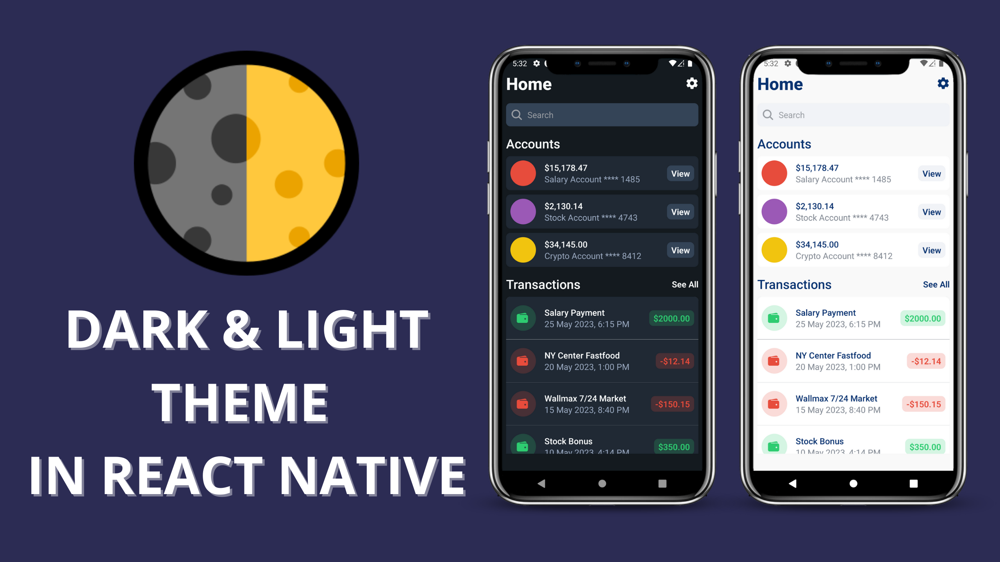

## How to implement dark/light theme in React Native?


### 📽️YouTube Tutorial
https://youtu.be/bDD9hwjdDqc

### 📖Read blog post about the video
https://reactnativespace.com/tutorials/dark-and-light-theme-in-react-native

### 📘 React Navigation Default Light & Dark Theme
https://github.com/react-navigation/react-navigation/blob/9fe34b445fcb86e5666f61e144007d7540f014fa/packages/native/src/theming/DefaultTheme.tsx
https://github.com/react-navigation/react-navigation/blob/9fe34b445fcb86e5666f61e144007d7540f014fa/packages/native/src/theming/DarkTheme.tsx

### 🔥This video answers following questions;
- ✅How to implement dark and light theme?
- ✅How to implement basic fadein animation with react reanimated?

### 📘 Installation
Clone the repo to your directory and install the packages through npm using:
```
npm install
```

### 🔬 Run
Run the project with Metro Bundler
```
npx expo start
```


### 👇 Follow me;
- https://reactnativespace.com
- https://github.com/reactnativespace
- https://twitter.com/reactnativespc
- https://instagram.com/reactnativespace
- https://www.tiktok.com/@reactnativespace
